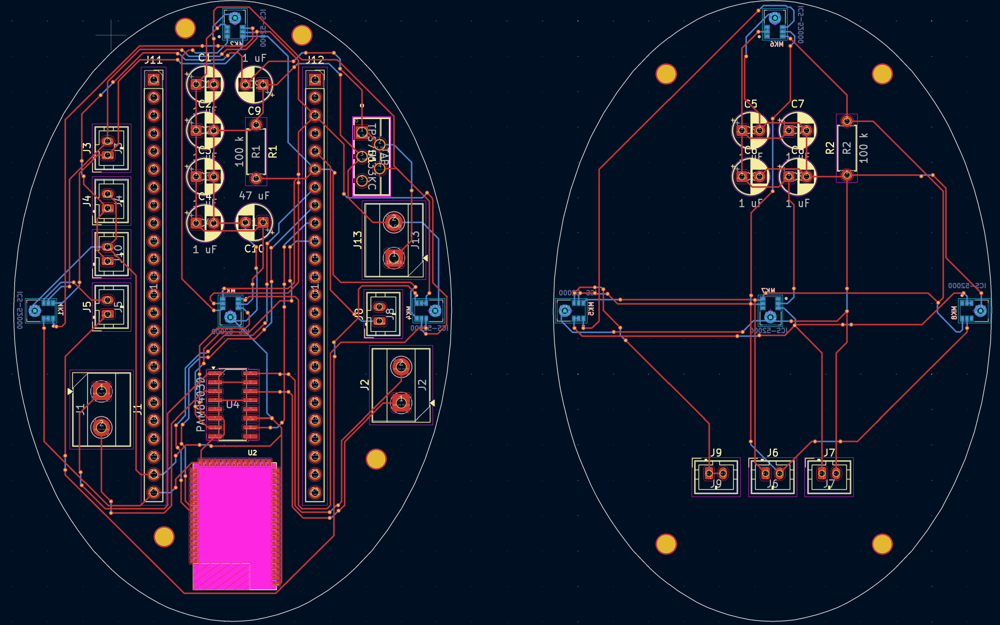
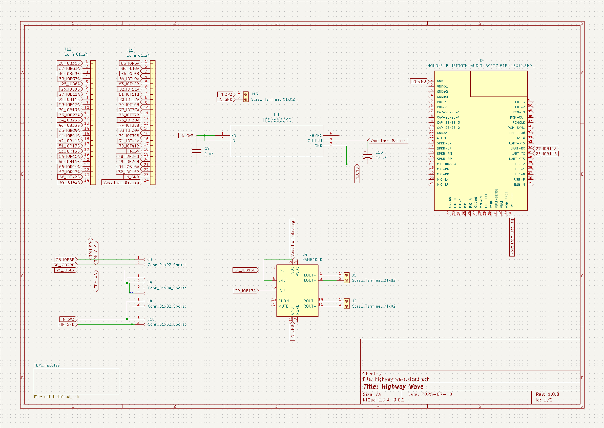

# ~ wave ~
*wave* is an attempt to revolutionize the head phone listening experience. If you know me irl, you'll know that I easily lose focus when people talk to me and I proactively believe I am going deaf. *wave* attempts to fix this issue by serving a a directional source selector for incoming sounds, eliminating distractions from environmental noise. 

These headphones utilize an FPGA, I2S MEMS microphones, and scrap headphone drivers. The FPGA and RPI work in tandem to collect and process incoming signals real time, seamlessly upgrading the listening experience.

The headphones have 2 half PCBs, which are connected via 3 JST cables. It collects audio data through 8 ICS-520000 MEMS microphones, connected together via TDM and parsed directly on the FPGA. The data is then quickly ran through a reduced TF-Gridnet DNN, where the target speaker is isolated and played back to the user.

# Schematic

# BOM
| Item                        |   Price                           | Quantity |  Subtotal                                    |
|-----------------------------|-----------------------------------|----------|----------------------------------------------|
| Ear cup / case              |  $              10.00             | 1        |  $                             10.00         |
| Head band                   |  $                       10.00    | 1        |  $                             10.00         |
| Bluetooth                   |  $                          1.79  | 1        |  $                               1.79        |
| Aliexpress shipping         |  $                6.63            | 1        |  $                               6.63        |
| Aliexpress tax              |  $                4.42            | 1        |  $                               4.42        |
| Cushion / seal material     |  $                5.26            | 2        |  $                             10.52         |
| LiPo                        |  $                4.95            | 2        |  $                               9.90        |
| Sound amp                   |  $                1.26            | 1        |  $                               1.26        |
| Charge Protection IC        |  $                1.99            | 1        |  $                               1.99        |
| Tang Nano 9k                |  $              18.17             | 1        |  $                             18.17         |
| Amazon Shipping / Handling  |  $              12.98             | 1        |  $                             12.98         |
| Amazon Estimated Tax        |  $                9.11            | 1        |  $                               9.11        |
| Audio driver for headphones |  $                       10.69    | 2        |  $                             21.38         |
| Digikey Shipping            |  $                6.99            | 1        |  $                               6.99        |
| Digikey Tarriff             |  $                2.14            | 1        |  $                               2.14        |
| Ebay shipping               |  $                4.95            | 1        |  $                               4.95        |
| Ebay tax                    |  $                0.64            | 1        |  $                               0.64        |
| Buttons                     |  $                          5.00  | 4        |  $                             20.00         |
| LED                         |  $                    -           | 2        |  $                                      -    |
| PCB (L + R)                 |  $                8.27            | 1        |  $                               8.27        |
| I2S Microphones             |  $                2.84            | 10       |  $                             28.40         |
| Mouser shipping             |  $                7.99            | 1        |  $                               7.99        |
| TOTAL                       |                                   |          |  $                          197.53           |