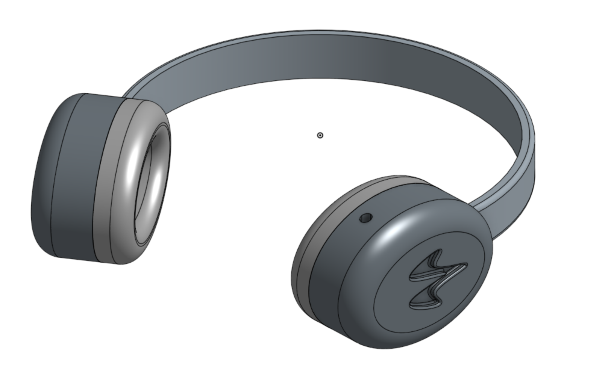

# ~ wave ~
*wave* is an attempt to revolutionize the head phone listening experience. If you know me irl, you'll know that I easily lose focus when people talk to me and I proactively believe I am going deaf. *wave* attempts to fix this issue by serving a a directional source selector for incoming sounds, eliminating distractions from environmental noise. 

These headphones utilize an FPGA, RPI Zero 2, BLE, I2S MEMS microphones, and scrap headphone drivers. The FPGA and RPI work in tandem to collect and process incoming signals real time, seamlessly upgrading the listening experience.

# Schematic

# BOM
| Item                        | Part Name                   | Unit Price      | Quantity |             |
| --------------------------- | --------------------------- | --------------- | -------- | ----------- |
| Audio driver for headphones | HPD-50N25PR00-32            |  $      10.69   | 2        |             |
| Sound amp                   | PAM8403                     |  $         5.69 | 1        |             |
| Raspberry Pi Zero 2 WH      |                             |  $      15.00   | 1        |             |
| Tang Nano 9k                | GOWIN GW1NR-9 RISC-V        |  $      30.00   | 1        |             |
| I2S Microphones             | INMP441                     |  $         8.00 | 16       |             |
| Ear cup / case              |                             |  $      10.00   | 2        |             |
| Cushion / seal material     |                             |  $      10.00   | 2        |             |
| Head band                   |                             |  $      10.00   | 1        |             |
| Battery                     | Lithium Polymer ion Battery |  $      10.00   | 1        |             |
| LED                         |                             |                 |          |             |
| Buttons                     |                             |  $         5.00 | 4        |             |
| Bluetooth                   | CSR8645                     |  $         6.05 | 1        |             |
| TOTAL                       |                             |                 |          |  $   286.12 |