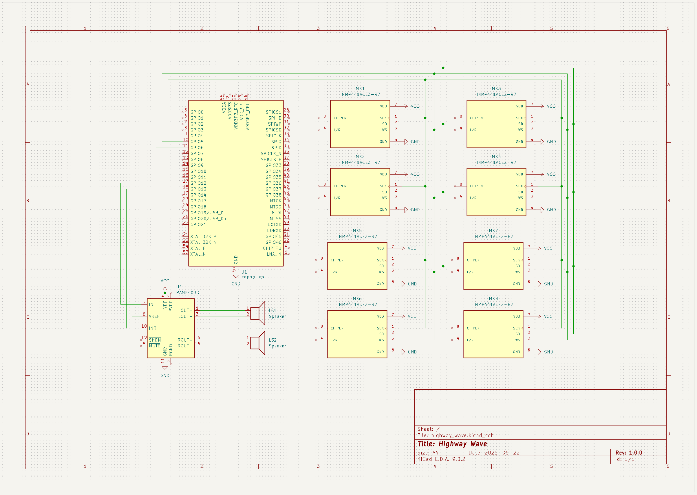
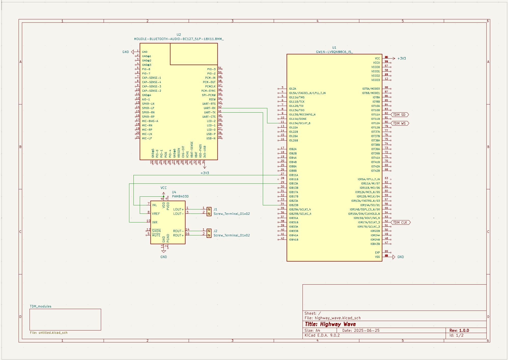
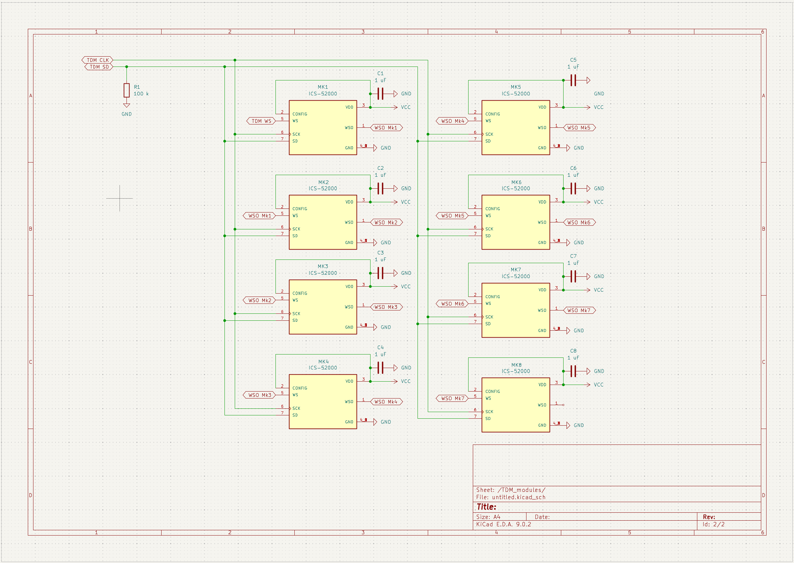
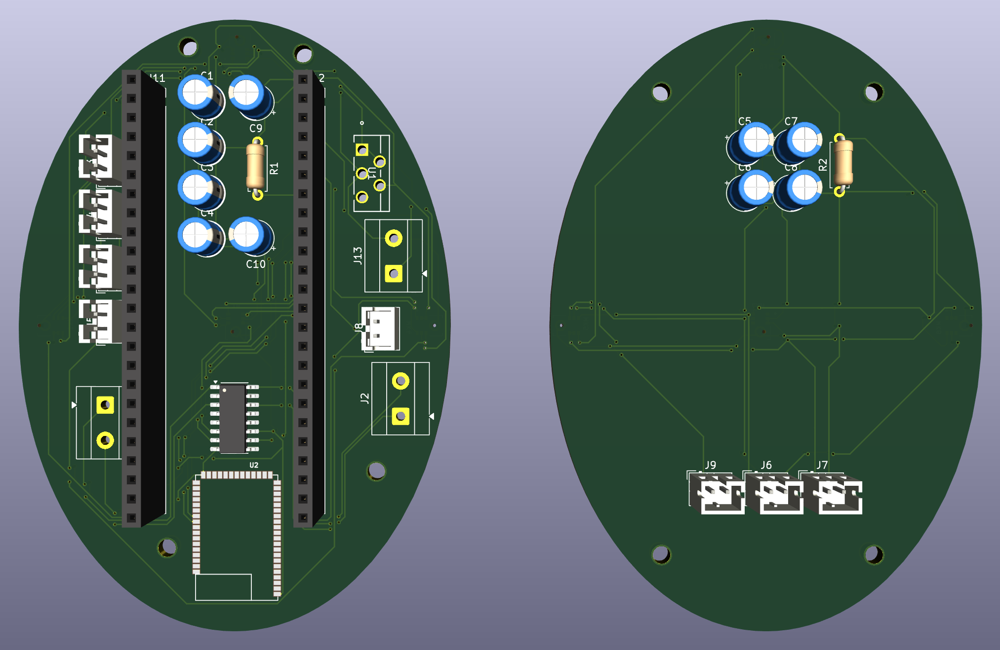
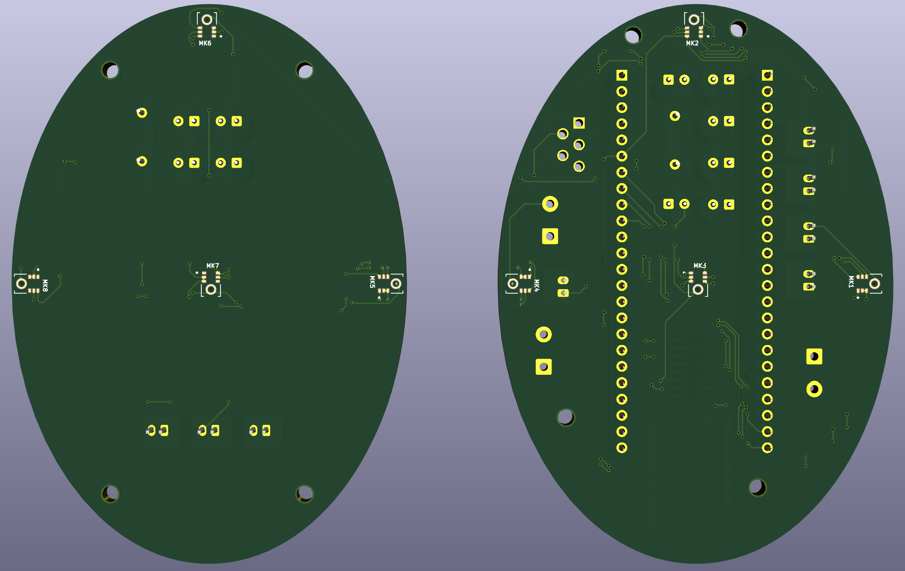
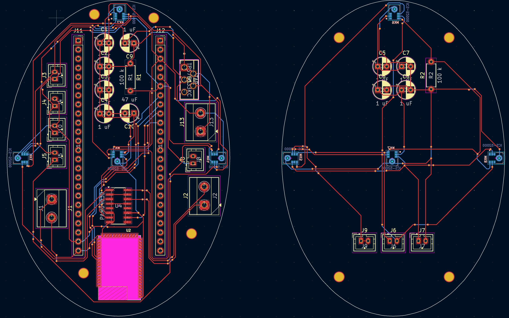
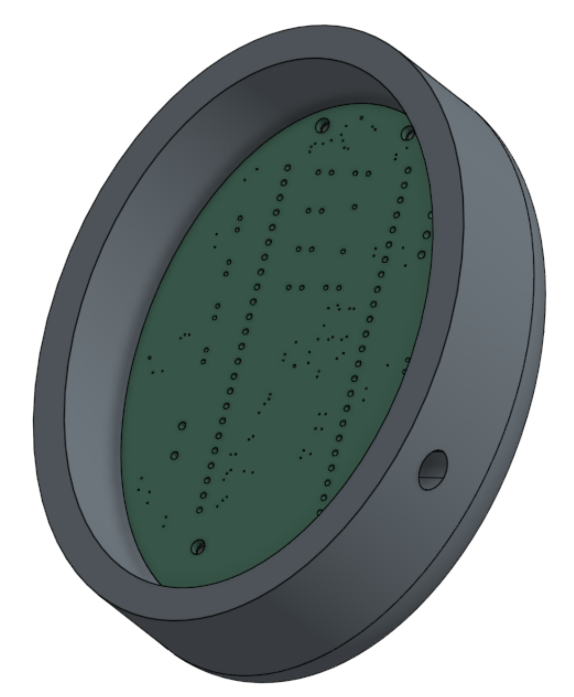
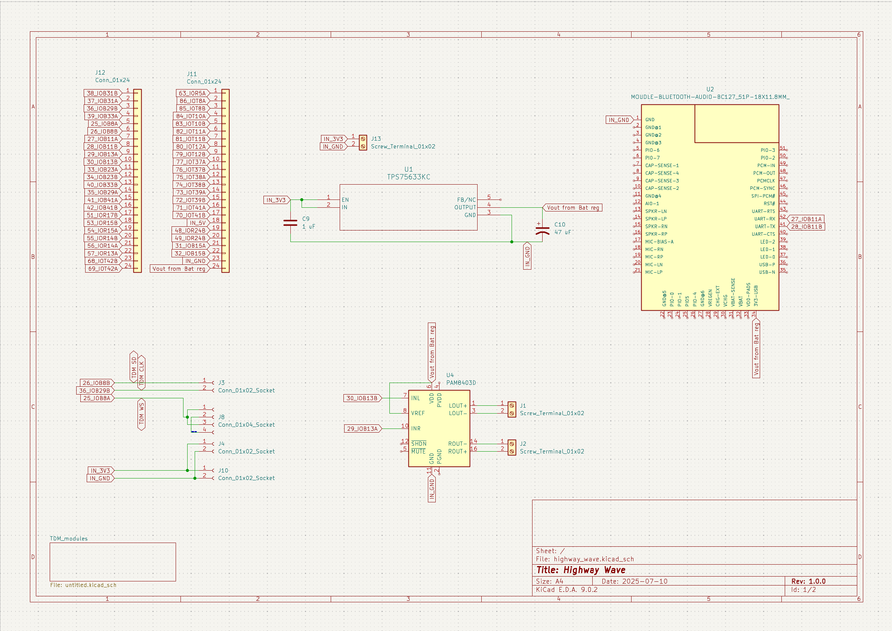
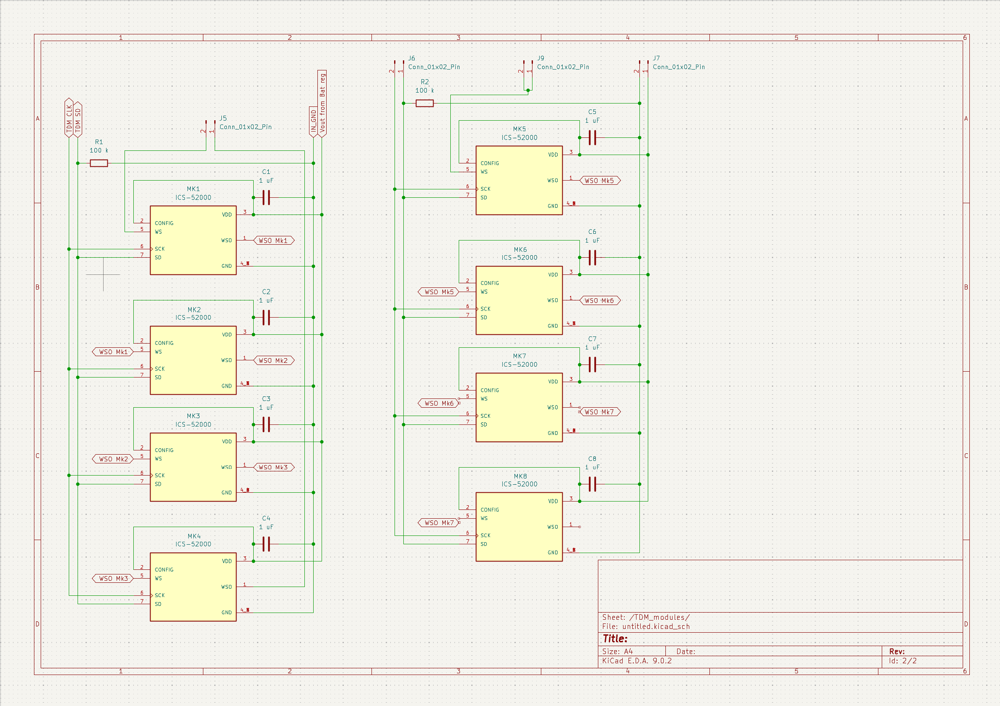

# Total time spent: 10.5
(Likely will increase after I get the parts cuz FPGAs are kind of a nightmare)

# May 22nd: Starting!

Hello, today I started writing my project pitch. I created my BOM and look at some other projects for inspiration.

Here's what I have so far:

I want to create something that can listen to omnidirectional audio and significantly clean up the output. I hope to help people with hearing problems.

**Time spent: 1 h**

---
# June 13th: Finished the headphone CAD

Today I used OnShape to design the electronic housing + headband.

The Tang Nano 9k is the largest item I anticipate using and thus I designed the ear cup around it. Here's a picture for the size of the Tang Nano 9k:

Here's what the headphones look like. I like the logo!

Also, I started the schematic. I imported the Raspberry Pi Zero W onto the schematic and tried finding the footprint for the Tang Nano 9k but I wasn't able to :/ Guess I'll continue tmr? 

**Time spent: 4.5 h**

---
# June 14th: Continued working on Schem

There isn't any existing footprint for the Tang Nano 9k so I figured the Gowin chip it uses would be a sufficient representation of the board. Here's what the schem looks like so far::

I also did research on the most appropriate driver for my application. Here are some quick facts:
Dynamic (Most common)
- Electromagnet causes voice coil to vibrate for sound waves
- What does resistance have to do with the quality?

Planar magnetic
- Need amp

Balanced armature
- Small build for in-=ear monitors
- Pivot between two magnets to make sound

Electrostatic
- Static charge applied to thin film between two pieces of metal
- Free from secondary distortion
- Expensive compared to others

Piezoelectoric
- Voltage applied to crystal or ceramic

Bone-Conduction
- Vibrate bones
- Sound leakage

I think dynamic drivers are the best for me since I want to focus more on the software aspect rather than experiment with driver quality. Dynamic drivers are well established and have tons of documentation. However, I still need to figure out which model to buy...

**Time spent: 1.5 h**

---
# June 19th: FINISHED Schem

OH MY GOD THIS TOOK ALL DAY. 

I updated the BOM with the component names and found footprints for all essential items. This in itself took maybe 2 hours to finish especially because I was a little indecisive and sometimes the footprint was just pay-walled :/

Anyway, after I finished finding all the kicad.sch files, I looked up datasheets an added it to the "reference_files" folder. I used these datasheets in figuring out how to wire these items. 

My BOM requests 16 I2S mics but I only wired 4 on the schem to conserve space. All of them would be wired in the same way and do essentially the same operation. 

There's a bunch of software things I need to figure out once I get all the stuff so yea.

**Time spent: 3.5 h**

---
# June 22nd: Revised schem

My entry was rejected I think? But I needed to simplify it a bit anyway. 

I think I'm gonna move away from FPGA to make the project more feasible. Cool idea but idk how to implement it.

Here's the schematic as of now:

I reverted back to an ESP32-S3 cuz that's what I'm familiar with. Plus, it has TDM support so I can get low latency audio using I2S mics. Most of the time spent today was just on researching appropriate approaches to this project.

**Time spent: 3.5 h**

---
# June 25th: Re-re-direction back to FPGA

Ok I just thought a lot about what my project means to me and I think a lot of it is just learning more and I'd like to do that with an FPGA. I have a better idea of how I'm gonna approach this project and refined some of the things I'm including.

MAJOR change: using a TDM mic array
* INMP441 didn't have a good footprint so I looked around and found the ICS 43434 which I thought did what I wanted but I found that wiring TDM is better (time dimensional multiplexing)
* ok THUS I shifted to using ICS 52000
* also new BLE module cuz I couldnt for the life of me find the footprint for the one I chose initially (prob cuz I just took whatever was on ebay)

Schems as of today: 

* I learned abt hierarchical schems today!!

**Time spent: 5 h**

---
# July 2/3/4 Redoing all PCB and fitting it into Onshape

Ngl I completely forgot to do journals. But I did redo the entire pcb, added tap holes, made an actual ovalar edge cut using a vector, and crashed tfo when I discovered it was still too big :)

Oh yea also I changed the schem a lot so that I can order the Tang Nano 9k and just plug it in to my pcb.

I made a hierachical schem and broke out the ICS-52000 MEMS mics onto the second page. Each side of the PCB is connected with JST connectors, which will run via the head band and be hidden with a layer of cotton batting.

**Time spent: 10 h**

--- 
# July 10th: Finally wrapping this up and hopefully passing the grant!!!

Added my Verilog files from the GOWIN EDA app (top file found in `./project_files/gowin/wave/src/top.v`). I also touched up a little bit of the Onshape file, produced the gerber files, and will update the BOM in a bit.

**Time spent: 1 h**