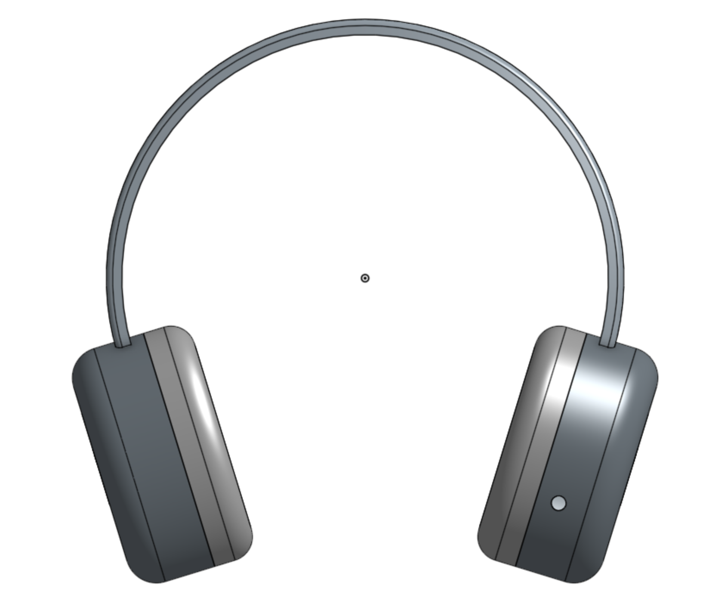

# May 22nd: Starting!

Hello, today I started writing my project pitch. I created my BOM and look at some other projects for inspiration.

Here's what I have so far:

I want to create something that can listen to omnidirectional audio and significantly clean up the output. I hope to help people with hearing problems.

**Total time spent: 1h**
---
# June 13th: Finished the headphone CAD

Today I used OnShape to design the electronic housing + headband.

The Tang Nano 9k is the largest item I anticipate using and thus I designed the ear cup around it. Here's a picture for the size of the Tang Nano 9k:

Here's what the headphones look like. I like the logo!

**Total time spent: 2.5h**
---